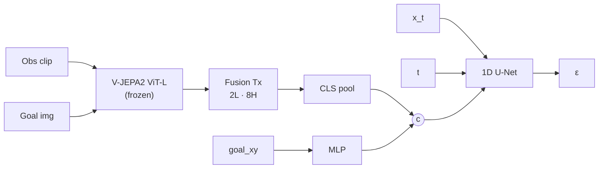

# VJEPA + Diffusion Policy

Training and inference for a navigation policy that conditions a diffusion
policy on V-JEPA2 visual context features. Trajectories (waypoints) are
predicted by a conditional 1D U-Net denoiser over a sequence of past frames
and an optional goal image.

Inspired by [visualnav-transformer](https://github.com/robodhruv/visualnav-transformer)
(NoMaD / ViNT / GNM); the data pipeline and several training utilities are
adapted from that codebase (see [Inherited from the original visualnav-transformer / NoMaD codebase](#inherited-from-the-original-visualnav-transformer--nomad-codebase) below).

## Demo

Inference rollout on a SCAND clip (Jackal, GDC library):


## Architecture



`Tc` = context frames, `Tp` = predicted-waypoint horizon (`len_traj_pred`).
The V-JEPA2 encoder is loaded from `torch.hub` and kept frozen; everything
downstream of it is trained. Classifier-free guidance drops the goal tokens
at training time and is hoisted out of the diffusion loop at inference.

## Layout

Library code at repo root (imported by the scripts below):

- `model_vjepa_diffusion.py` — `VJepa2NavModel` (V-JEPA2 encoder + diffusion head)
- `vjepa_dataset.py` — `VJEPADataset`: loads trajectories, samples context windows, computes action targets

Scripts, grouped by purpose:

- `train/`
  - `train_vjepa.py` — main training loop
- `inference/`
  - `vjepa_inference_video.py` — single-clip inference and rendering
  - `render_clips.py` — batched inference over multiple clips with one model load
  - `rank_recon.py` — rank RECON trajectories by displacement (helper for picking inference clips)
- `tests/`
  - `smoke_test.py` — end-to-end dataset → model fwd/bwd → inference smoke test
  - `generate_spoof_data.py` — synthesize a tiny fake dataset for smoke testing
- `data_prep/`
  - `data_split.py` — write `traj_names.txt` train/test split files for a processed dataset
  - `process_recon.py` — convert the RECON HDF5 release into the on-disk trajectory format
  - `process_bags.py` — generic ROS-bag → trajectory converter (used for SCAND, tartan_drive,
    locobot, sacson; dataset selected via `-d <tag>` against
    `vint_train/process_data/process_bags_config.yaml`). Requires the `rosbag` Python
    bindings; see `data_prep/setup_rosbag_env.sh`.
  - `frames_to_video.py` — utility

Each script directory is a Python package (has an `__init__.py`). Run
scripts from the repo root using `python -m`, e.g.
`python -m train.train_vjepa --config config/vjepa.yaml` — this puts the
repo root on `sys.path` so scripts can import the library modules.

Configs live in `config/`: `defaults.yaml`, `vjepa.yaml`, `vjepa_test.yaml`.
Conda env: `train_environment_vjepa.yml`.

`diffusion_policy/` is the vendored diffusion-policy library
(provides the conditional U-Net and related modules), included as a git
submodule pinned to upstream `real-stanford/diffusion_policy`.

## Setup

Clone with submodules and create the conda env:

```bash
git clone --recurse-submodules <this-repo-url>
cd vjepa_diffusion_nav
conda env create -f train_environment_vjepa.yml
conda activate vjepa_train
pip install -e diffusion_policy/
```

If you already cloned without `--recurse-submodules`:

```bash
git submodule update --init --recursive
```

## Inherited from the original visualnav-transformer / NoMaD codebase

Several pieces of training infrastructure are reused as-is from the upstream
`visualnav-transformer` repo. The relevant module is kept in-tree as
`vint_train/`:

- **`vint_train/data/data_config.yaml`** — read by `vjepa_dataset.py` to get
  per-dataset `metric_waypoint_spacing`, action statistics, and camera
  intrinsics for image rectification. Edit this file to add a new dataset.
- **`vint_train/data/data_splits/<dataset>/{train,test}/traj_names.txt`** —
  the train/test partition format. Each line names a trajectory folder.
  Generated by `data_split.py` (whose `--data-splits-dir` defaults to
  `vint_train/data/data_splits`).
- **On-disk trajectory format** — a directory per trajectory containing
  `traj_data.pkl` (`{"position": Nx2, "yaw": N}`) plus numbered RGB frames
  (`0.jpg`, `1.jpg`, ...). This is the format produced by `process_recon.py`.
- **LMDB image cache layout** — `vjepa_dataset.py` writes per-split LMDBs
  next to `traj_names.txt` (controlled by `use_lmdb_cache: True` in the
  dataset config).

Nothing in the kept VJEPA code imports `vint_train` as a Python package;
the dependency is purely on file paths and on-disk formats. The rest of
`vint_train/` (NoMaD/ViNT/GNM models, training utils, visualizers) is
unused by this codebase and only kept here so the data-config and
data-splits paths stay valid.

## Data pipeline

### Public datasets

The codebase has been used with the following publicly available
navigation datasets:

- [RECON](https://sites.google.com/view/recon-robot/dataset)
- [TartanDrive](https://github.com/castacks/tartan_drive)
- [SCAND](https://www.cs.utexas.edu/~xiao/SCAND/SCAND.html#Links)
- [GoStanford2 (Modified)](https://drive.google.com/drive/folders/1RYseCpbtHEFOsmSX2uqNY_kvSxwZLVP_?usp=sharing)
- [SACSoN/HuRoN](https://sites.google.com/view/sacson-review/huron-dataset)

`process_recon.py` handles RECON HDF5s directly; for the others, you'll
need a similar preprocessing pass that emits the trajectory layout below.

### Trajectory layout

After preprocessing, each dataset directory should look like:

```
<dataset_name>/
├── <traj_1>/
│   ├── 0.jpg
│   ├── 1.jpg
│   ├── ...
│   ├── T_1.jpg
│   └── traj_data.pkl
├── <traj_2>/
│   └── ...
```

Each `*.jpg` is a forward-facing RGB observation, temporally ordered.
`traj_data.pkl` is a pickled dict with keys:

- `"position"` — `np.ndarray [T, 2]`, xy-coordinates at each frame
- `"yaw"` — `np.ndarray [T]`, yaw at each frame

After splitting, splits live in
`vint_train/data/data_splits/<dataset_name>/{train,test}/traj_names.txt`.

### End-to-end

1. **Preprocess** the raw release into the trajectory format
   (`process_recon.py` for RECON).
2. **Split** with `data_split.py`:
   ```bash
   python -m data_prep.data_split -i <processed_dataset_dir> -d <dataset_name> -s 0.8
   ```
   This writes `vint_train/data/data_splits/<dataset_name>/{train,test}/traj_names.txt`.
3. **Configure** `config/vjepa.yaml`: under `datasets:` set `data_folder`
   (the processed dataset dir) and `train` / `test` (the split dirs from
   step 2). Per-dataset waypoint spacing should match
   `vint_train/data/data_config.yaml`.
4. **Train**:
   ```bash
   python -m train.train_vjepa --config config/vjepa.yaml
   ```
5. **Inference / rendering**: `python -m inference.vjepa_inference_video` for
   a single clip, `python -m inference.render_clips` for batched rendering
   of a fixed clip list.

### Adding a custom dataset

1. Lay out the dataset to match the [trajectory layout](#trajectory-layout)
   above.
2. Append an entry to `vint_train/data/data_config.yaml`:
   ```yaml
   <dataset_name>:
     metric_waypoint_spacing: <avg meters between waypoints>
     # plus action stats and camera intrinsics as in existing entries
   ```
3. Run `data_split.py` to produce `traj_names.txt`.
4. Add the dataset to `config/vjepa.yaml` under `datasets:`:
   ```yaml
   <dataset_name>:
     data_folder: <path_to_dataset>
     train: vint_train/data/data_splits/<dataset_name>/train/
     test:  vint_train/data/data_splits/<dataset_name>/test/
     end_slack: 0      # trim N frames off each trajectory's end
     goals_per_obs: 1
     negative_mining: True
   ```
