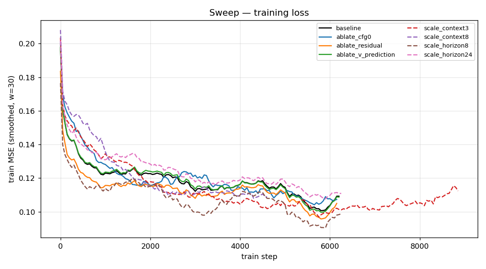
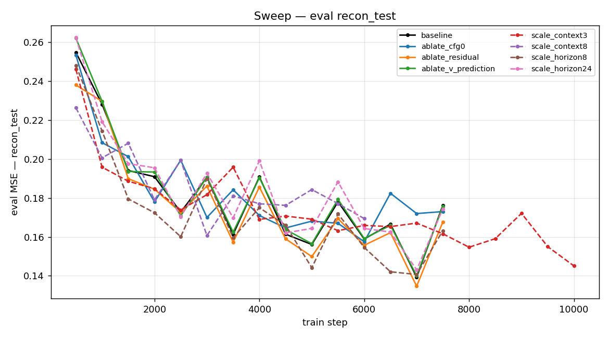
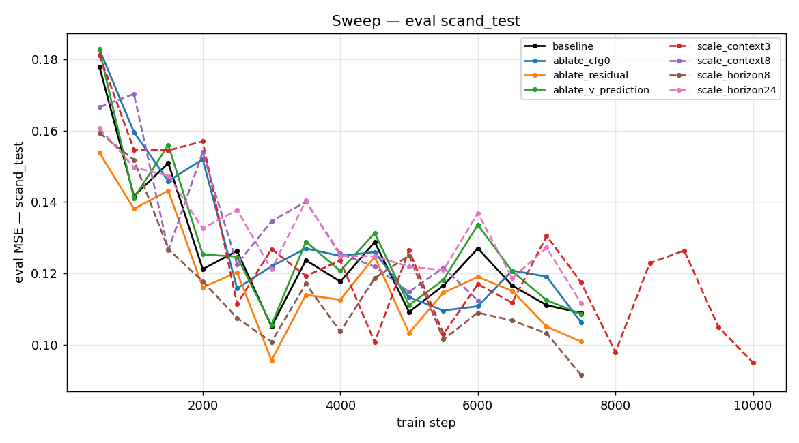
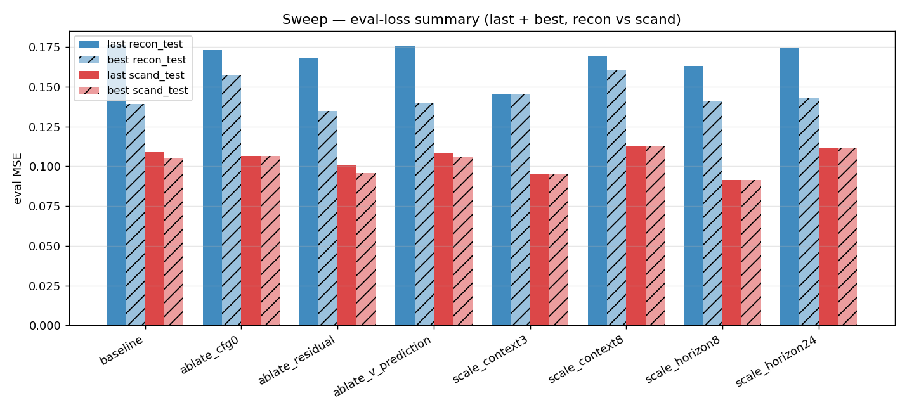

# Experiments

Sweep results over the V-JEPA2 + diffusion-policy training recipe.
Each version below is a self-contained batch of runs — table, plots,
and raw CSV.

## v1 — Initial ablation + scaling sweep

Each run varies a single config field off the baseline; all 8 ran on a
single A100 with a 4 h SLURM budget and were stopped at timeout (none
reached the planned epoch count).

### Eval summary

All numbers are MSE on the held-out splits (lower is better). `train` is
the mean training loss over the last 100 steps. `step / total` shows
how far each run got before the wall-clock cut it.

| Run | Override | step / total | train | last recon | best recon | last scand | best scand |
|---|---|---|---|---|---|---|---|
| `baseline` | — | 7,650 / 12,058 | 0.114 | 0.176 | 0.139 | 0.109 | 0.105 |
| `ablate_cfg0` | `cfg_dropout_prob: 0.0` | 7,600 / 12,058 | 0.113 | 0.173 | 0.158 | 0.106 | 0.106 |
| `ablate_residual` | `use_residual: True` | 7,600 / 12,058 | 0.110 | 0.168 | 0.135 | 0.101 | 0.096 |
| `ablate_v_prediction` | `diffusion_prediction_type: v_prediction` | 7,650 / 12,058 | 0.114 | 0.176 | 0.140 | 0.109 | 0.106 |
| `scale_context3` | `context_size: 3` | 10,300 / 12,459 | 0.106 | **0.145** | **0.145** | 0.095 | 0.095 |
| `scale_context8` | `context_size: 8` | 6,050 / 11,485 | 0.116 | 0.169 | 0.161 | 0.112 | 0.112 |
| `scale_horizon8` | `len_traj_pred: 8` | 7,700 / 13,759 | **0.103** | 0.163 | 0.141 | **0.092** | **0.092** |
| `scale_horizon24` | `len_traj_pred: 24` | 7,700 / 10,602 | 0.117 | 0.174 | 0.143 | 0.112 | 0.112 |

### Plots

Training loss (smoothed):

Eval MSE on `recon_test`:

Eval MSE on `scand_test`:

Last vs best eval MSE, side-by-side:

Raw numbers: [`assets/plots/sweep_v1/sweep_summary.csv`](assets/plots/sweep_v1/sweep_summary.csv).

<!-- ## v2 — TBD
Add the next sweep's section below, mirroring v1's structure:
plots under `assets/plots/sweep_v2/`. -->
