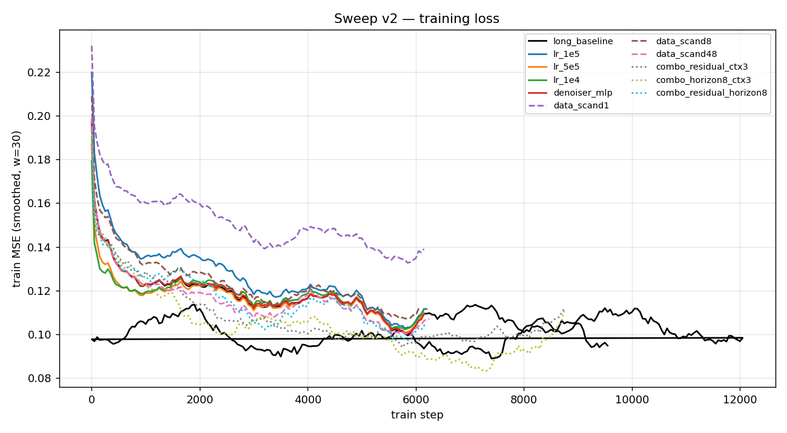
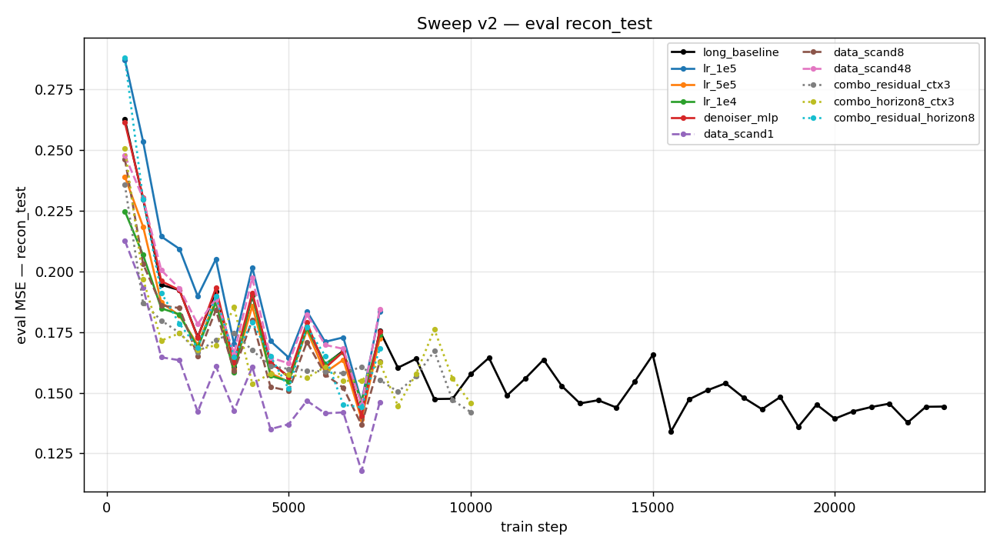
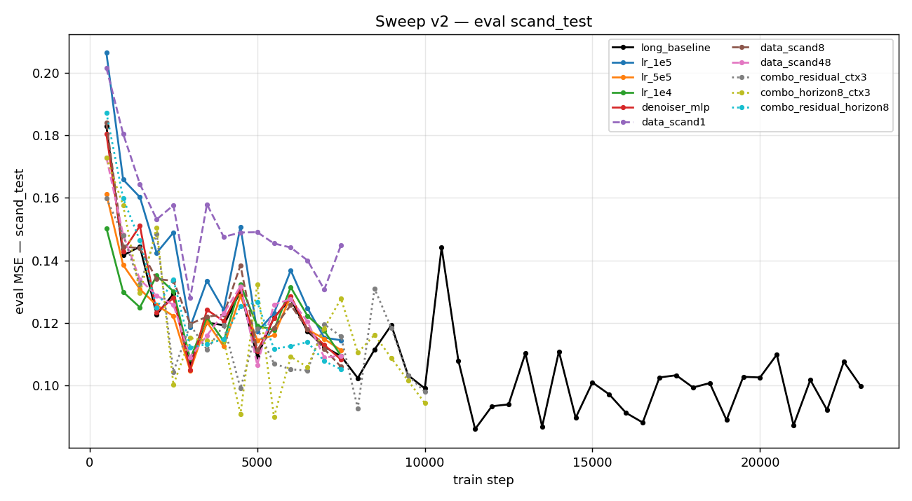
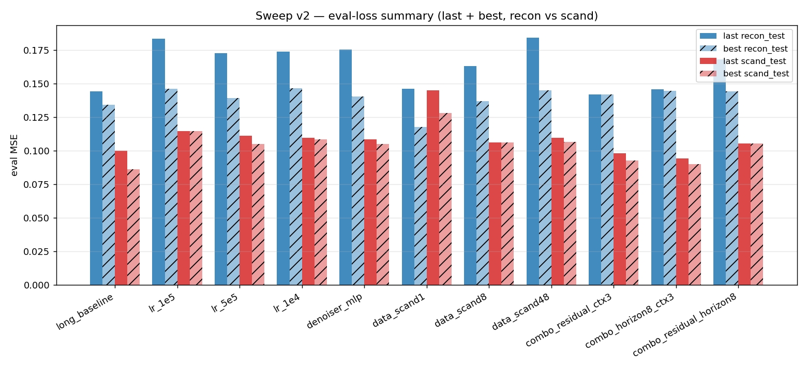

# Experiments

Sweep results over the V-JEPA2 + diffusion-policy training recipe.
Each version below is a self-contained batch of runs — table, plots,
and raw CSV.

## v1 — Initial ablation + scaling sweep

Each run varies a single config field off the baseline; all 8 ran on a
single A100 with a 4 h SLURM budget and were stopped at timeout (none
reached the planned epoch count).

### Eval summary

All numbers are MSE on the held-out splits (lower is better). `train` is
the mean training loss over the last 100 steps. `step / total` shows
how far each run got before the wall-clock cut it.

| Run | Override | step / total | train | last recon | best recon | last scand | best scand |
|---|---|---|---|---|---|---|---|
| `baseline` | — | 7,650 / 12,058 | 0.114 | 0.176 | 0.139 | 0.109 | 0.105 |
| `ablate_cfg0` | `cfg_dropout_prob: 0.0` | 7,600 / 12,058 | 0.113 | 0.173 | 0.158 | 0.106 | 0.106 |
| `ablate_residual` | `use_residual: True` | 7,600 / 12,058 | 0.110 | 0.168 | 0.135 | 0.101 | 0.096 |
| `ablate_v_prediction` | `diffusion_prediction_type: v_prediction` | 7,650 / 12,058 | 0.114 | 0.176 | 0.140 | 0.109 | 0.106 |
| `scale_context3` | `context_size: 3` | 10,300 / 12,459 | 0.106 | **0.145** | **0.145** | 0.095 | 0.095 |
| `scale_context8` | `context_size: 8` | 6,050 / 11,485 | 0.116 | 0.169 | 0.161 | 0.112 | 0.112 |
| `scale_horizon8` | `len_traj_pred: 8` | 7,700 / 13,759 | **0.103** | 0.163 | 0.141 | **0.092** | **0.092** |
| `scale_horizon24` | `len_traj_pred: 24` | 7,700 / 10,602 | 0.117 | 0.174 | 0.143 | 0.112 | 0.112 |

### Plots

Training loss (smoothed):

Eval MSE on `recon_test`:

Eval MSE on `scand_test`:

Last vs best eval MSE, side-by-side:

Raw numbers: [`assets/plots/sweep_v1/sweep_summary.csv`](assets/plots/sweep_v1/sweep_summary.csv).

## v2 — LR / data weighting / denoiser / combos / long budget

11 runs probing axes v1 didn't touch: learning rate, scand dataset
upweight ratio, MLP vs U-Net denoiser, two-axis combinations of v1
leaders, and a 12 h budget baseline. All 4 h runs hit timeout (same
constraint as v1); `long_baseline` ran the full 12 h and reached step
11,000 / 12,058.

### Eval summary

| Run | Override(s) | step / total | train | last recon | best recon | last scand | best scand |
|---|---|---|---|---|---|---|---|
| `long_baseline` (12 h) | baseline, longer wall-clock | 11,000 / 12,058 | 0.097 | **0.144** | 0.134 | 0.100 | **0.086** |
| `lr_1e5` | `lr: 1e-5` | 7,650 / 12,058 | 0.118 | 0.183 | 0.146 | 0.115 | 0.115 |
| `lr_5e5` | `lr: 5e-5` | 7,600 / 12,058 | 0.114 | 0.172 | 0.139 | 0.111 | 0.105 |
| `lr_1e4` | `lr: 1e-4` | 7,600 / 12,058 | 0.115 | 0.174 | 0.146 | 0.110 | 0.109 |
| `denoiser_mlp` | `denoiser_type: mlp` | 7,600 / 12,058 | 0.114 | 0.175 | 0.140 | 0.108 | 0.105 |
| `data_scand1` | scand `dataset_weight: 1.0` | 7,600 / 12,058 | 0.145 | 0.146 | **0.118** | 0.145 | 0.128 |
| `data_scand8` | scand `dataset_weight: 8.0` | 7,550 / 12,058 | 0.117 | 0.163 | 0.137 | 0.106 | 0.106 |
| `data_scand48` | scand `dataset_weight: 48.0` | 7,700 / 12,058 | 0.110 | 0.184 | 0.145 | 0.110 | 0.107 |
| `combo_residual_ctx3` | `use_residual: True` + `context_size: 3` | 10,200 / 12,459 | 0.102 | 0.142 | 0.142 | 0.098 | 0.093 |
| `combo_horizon8_ctx3` | `len_traj_pred: 8` + `context_size: 3` | 10,200 / 14,230 | **0.096** | 0.146 | 0.145 | **0.094** | 0.090 |
| `combo_residual_horizon8` | `use_residual: True` + `len_traj_pred: 8` | 7,650 / 13,759 | 0.109 | 0.168 | 0.144 | 0.105 | 0.105 |

### Plots

Training loss (smoothed):

Eval MSE on `recon_test`:

Eval MSE on `scand_test`:

Last vs best eval MSE, side-by-side:

Raw numbers: [`assets/plots/sweep_v2/sweep_summary.csv`](assets/plots/sweep_v2/sweep_summary.csv).
